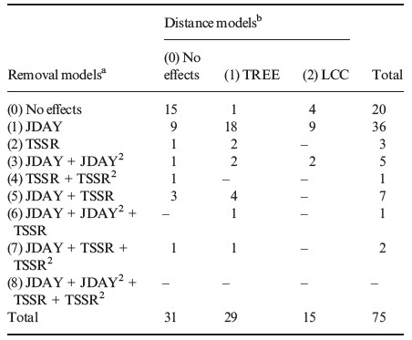
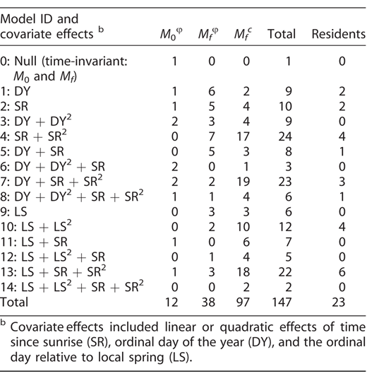
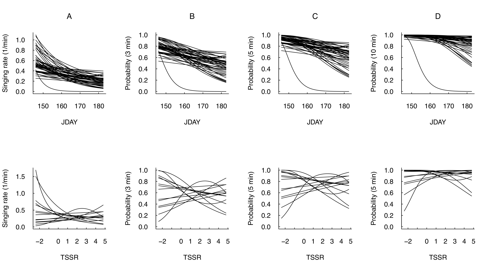
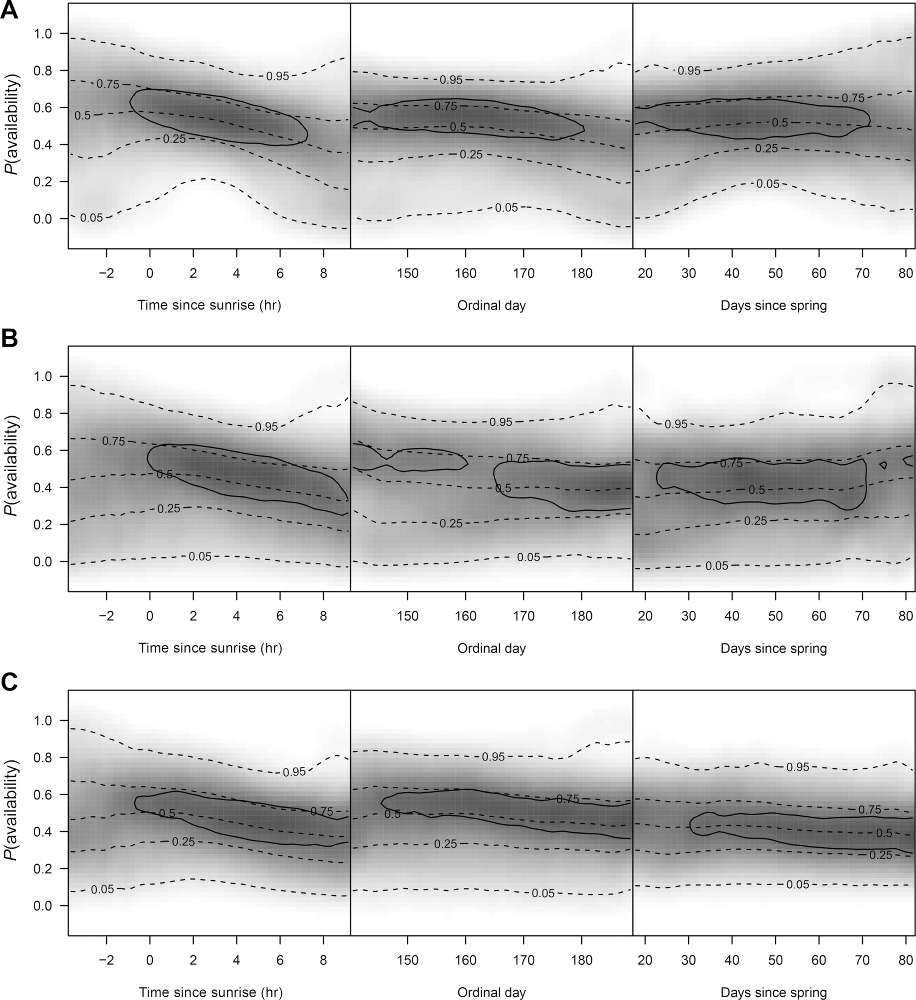
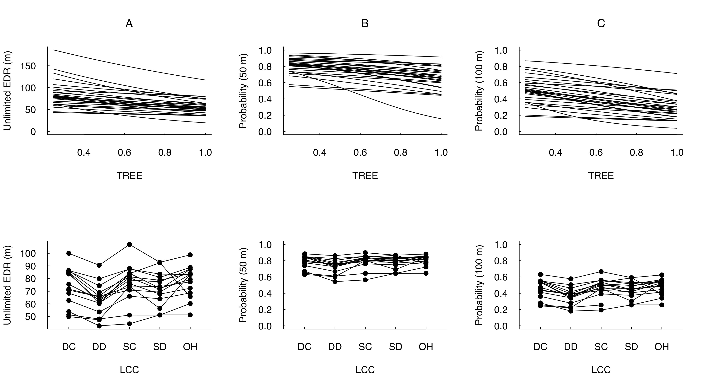
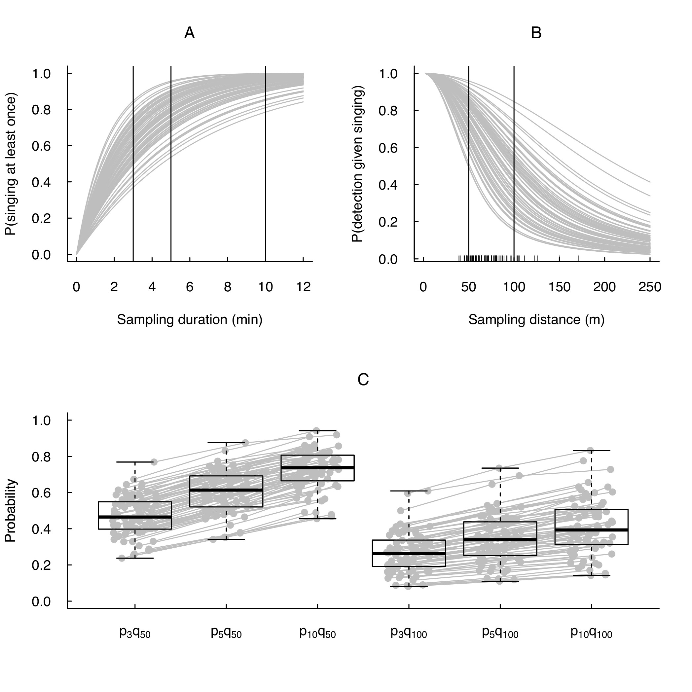

```{r setup,include=FALSE}
options(width=53, scipen=999)
library(knitr)
```

# Outline

Day 1

- ~~Introduction~~
- ~~We need to talk about data~~
- ~~A primer in regression techniques~~

Day 2

- Behavioral complexities

Day 3

- The detection process
- Dealing with recordings

Day 4

- Putting it all together
- Roadside surveys

***

# Get course materials

1. Visit [https://github.com/psolymos/qpad-workshop/releases](https://github.com/psolymos/qpad-workshop/releases)
2. Download the latest release into a __NEW__ folder
3. Extract the zip/tar.gz archive
4. Open the `workshop.Rproj` file in RStudio (or open any other R GUI/console and `setwd()` to the directory where you downloaded the file)
5. Move your __LOCAL__ files into the new folder to keep things together

***

# Local copy

Avoid conflicts as we update the workshop materials: work in a __LOCAL__ copy of the R markdown files

```{r eval=FALSE}
source("src/functions.R")
qpad_local(day=2)
```

LOCAL copies will not be tracked and overwritten by git. You can copy new files over and it will not impact your local copies.

***

# What is detectability?

In the most colloquial terms, $\delta$ is the probability
that a species is detected given it is present:

$$P(Y>0 \mid N>0)$$

***

# Occupancy

In an occupancy framework, we can have:

- A detection: true positives (false positive rate is 0)
  - $P(Y>0) = P(Y>0 \mid N>0) P(N>0) + P(Y>0 \mid N=0) P(N=0)$
  - $P(Y>0) = \delta \varphi + 0 (1-\varphi) = \delta \varphi$
- A non-detection: false negatives + true negatives
  - $P(Y=0) = P(Y=0 \mid N>0) P(N>0) + P(Y=0 \mid N=0) P(N=0)$
  - $P(Y=0) = (1-\delta) \varphi + 1 (1-\varphi) = 1- \delta \varphi$,

(These are the marginal probabilities used to estimate the parameters using maximum likelihood.)

***

# Side note on occupancy

People often confuse these two conditional probabilities:

1. Observing 0 given that the species is present:
  - $P(Y=0 \mid N>0) = 1-\delta$
2. Presence of a species given that we observe 0:
  - $P(N> 0 \mid Y=0) = \frac{P(Y=0 \mid N>0) P(N>0)}{P(Y=0)}$
  - $\frac{(1-\delta)\varphi}{\varphi (1-\delta) + (1-\varphi)} = \frac{\varphi (1-\delta)}{1-\delta \varphi}$

***

# Abundance

A lot more combinations of true abundance and observed counts:

|   | $Y$ = 0  |  1 | 2  |  ... |
|---|---|---|---|---|
|  $N$ = 0 | x  |   |   |   |
|  1 |  x | x  |   |   |
| 2  |  x | x  |  x |   |
| ...  | x  | x  | x  | x  |

***

# Estimating detectability

To estimate $\delta$, we need:

- ancillary information (multiple visits, distance bands, time intervals, multiple observers),
- parametric model assumptions (i.e. $\delta$ varies across locations).

***

# The myth of constant detectability

Detectability zealots often view a method that cannot estimate
constant detection probability $\delta$ 
(e.g. single-visit occupancy and N-mixture models) as inferior.

Fortunately for the rest of us: $\delta$ can only be constant
in very narrow situations, e.g. when surveys are conducted:

- in the same region,
- in similar habitat,
- in the same year,
- on the same day,
- at the same time,
- by the same observer,
- using the same protocol.

***

# Constant detectability is rare

Often a consequence of small sample size (i.e.
not a lot of detection for a species)[^1][^2]:

\centering
```{r echo=FALSE,out.width="400px",fig.show = 'hold',out.width='48%'}


```

[^1]: Solymos et al. 2013, [Methods. Ecol. Evol. 4:1047--1058](http://dx.doi.org/10.1111/2041-210X.12106).
[^2]: Solymos et al. 2018, [Condor 120:765--786](http://dx.doi.org/10.1650/CONDOR-18-32.1).

***

# Availability varies

\centering
```{r echo=FALSE,out.width="300px"}

```

***

# Availability really varies

\centering
```{r echo=FALSE,out.width="200px"}

```

***

# Biological mechanisms

- Migration timing drives phenology for many species, e.g. ordinal day of year (`DAY`),
- when study spans across biomes, use time since local spring (multi-year average),
- or time since spring green up, last snow day, etc. based on actual survey year,
- time of day,
- time since local sunrise (`TSSR`).

***

# Perceptibility varies too

\centering
```{r echo=FALSE,out.width="300px"}

```

***

# Physical mechanisms

- Trees block the transmission of sound
- Broad leaves rustle more
- Louder sounds travel farther
- Low frequency sounds travel farther

***

# Let's unwrap $\delta$

1. Once the species/individual is present ($N>0$)
2. It needs to signal its presence: make itself heard/visible, make itself available ($p$),
3. Then the signal needs to be received by a sensor: human ear or a microphone (and then the human ear in the lab listening to a recording), perceptibility $q$

These imply a pre-defined total time duration and maximum counting radius.

***

# QPAD

Now we can expand our equation:
$E[Y]=NC=(AD)(pq)=qpAD$

The expected value of the observed count becomes a function of the:

- population density ($D$),
- area sampled ($A$),
- availability ($p$),
- and perceptibility ($q$).

***

# Space and time to the rescue

\centering
```{r echo=FALSE,out.width="190px"}

```

$p$ is a monotonic function of _time_, while $q$ is monotonic function of _area_ (space).

***

# Simulate QPAD

```{r sim-pois}
D <- 2.0  # inds / unit area
A <- 1.0  # area
p <- 0.8  # availability
q <- 0.5  # perceptibility

n <- 100  # sample size
N <- rpois(n, lambda = A * D)
Y <- rbinom(n, size = N, prob = p * q)
```

***

# Output

```{r sim-pois2}
table(N=N, Y=Y)
```

***

# The model

- $(N \mid D,A) \sim Poisson(DA)$
- $(Y \mid N,p,q) \sim Binomial(N, pq)$.

Incorporates key components of reality, but also ignores a lot of details.

***

# Assumptions

- Observations are independent
- $Y$ involves no double counting
- Area is known and measured without error
- Detectability ($pq$) is independent of $N$

And a lot more that we'll cover later

***

# Why do we need simulation

Probabilistic simulation is useful to test how well a stat method is working _if_ the assumptions are met.

It is not quite as useful for assessing how robust the method is when the assumptions are _not_ met.

You need to link to biological mechanisms to do sensitivity analysis.

***

# It is a good pass time

\centering
_"I've yet to see any problem, however complicated, which when you looked at it the right way didn’t become still more complicated."_ --- Poul Anderson, Call Me Joe

***

# It is popular

\centering
```{r echo=FALSE,out.width="250px"}

```

_"Love the simulation we’re dreaming in"_ --- Dua Lipa, Physical

***

# bSims goals

- Allow easy __testing of statistical assumptions__ and explore effects of violating these assumptions
- __Aid survey design__ by comparing different options
- And most importantly, to __have fun__ while doing it via an intuitive and interactive user interface

***

# bSims design

- __Isolation__: the spatial scale is small (local point count scale) so that we can treat individual landscapes as more or less homogeneous units (but see below how certain stratified designs and edge effects can be incorporated) and independent in space and time
- __Realism__: the implementation of biological mechanisms and observation processes are realistic, defaults are chosen to reflect common practice and assumptions
- __Efficiency__: implementation is computationally efficient utilizing parallel computing backends when available
- __Extensibility__: the package functionality is well documented and easily extensible

***

# bSims verbs

- __Initialize__ (`bsims_init`): the landscape is defined by the extent and possible habitat stratification
- __Populate__ (`bsims_populate`): the population of finite number of individuals within the extent of the landscape
- __Animate__ (`bsims_animate`): individual behaviours described by movement and vocalization events, i.e. the frequency of sending various types of signals
- __Detect__ (`bsims_detect`): the physical side of the observation process, i.e. transmitting and receiving the signal
- __Transcribe__ (`bsims_transcribe`): the "human" aspect of the observation process, i.e. the perception of the received signal

***

# Behavioral events

Event time ($T$) is a continuous random variable

In the simplest case, its probability density function is the Exponential
distribution: $f(t)=\phi e^{-t\phi}$

The corresponding cumulative distribution function is:
$F(t)=\int_{0}^{t} f(t)dt=1-e^{-t\phi}=p_t$, the probability that the event has occurred by duration $t$

The parameter $\phi$ is the rate of the Exponential distribution
with mean $1/\phi$ and variance $1/\phi^2$.

***

# Survival and hazard function

The complement of $F(t)$ CDF is called the _survival function_ ($S(t)=1-F(t)$, $S(0)=1$), which gives the probability that the event has _not_ occurred by duration $t$.

The _hazard function_ ($\lambda(t)=f(t)/S(t)$) defines the instantaneous rate of occurrence of the event (_risk_, the density of events at $t$ divided by the probability of surviving).

The cumulative hazard (cumulative risk) is the sum of the risks between duration 0 and $t$ ($\Lambda(t)=\int_{0}^{t} \lambda(t)dt$).

***

# Exponential model

The simplest survival distribution assumes constant risk over time ($\lambda(t)=\phi$), which corresponds to the Exponential distribution.

The Exponential distribution also happens to describe the lengths of the 
inter-event times in a homogeneous Poisson process 
(events are independent, it is a 'memory-less' process).

***

# Exponential model visualized

\centering
```{r beh-events,message=FALSE,warning=FALSE,echo=FALSE,fig.width=6,fig.height=4.5}
library(bSims)
set.seed(321)
l <- bsims_init()
p <- bsims_populate(l, density = 0.5)
e1 <- bsims_animate(p, vocal_rate = 1)

plot(get_events(e1))
curve((1-exp(-1*x)) * get_abundance(e1), col=2, add=TRUE)
```

***

# Zoom in on mechanisms

Today we are focusing on availability, $p \in (0, 1)$

We assume that peceptibility is $q=1$


