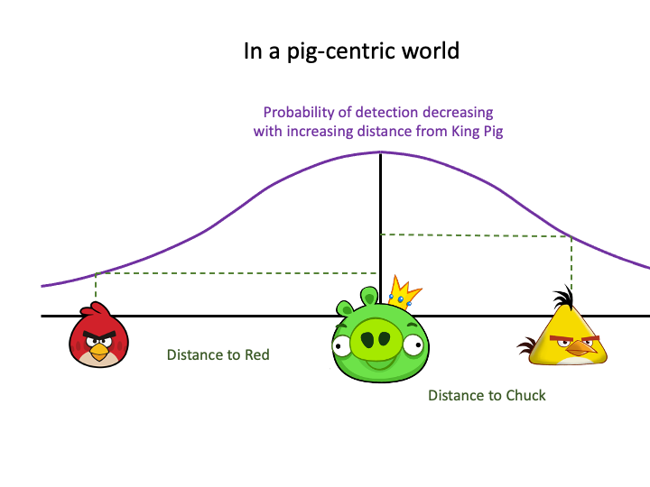
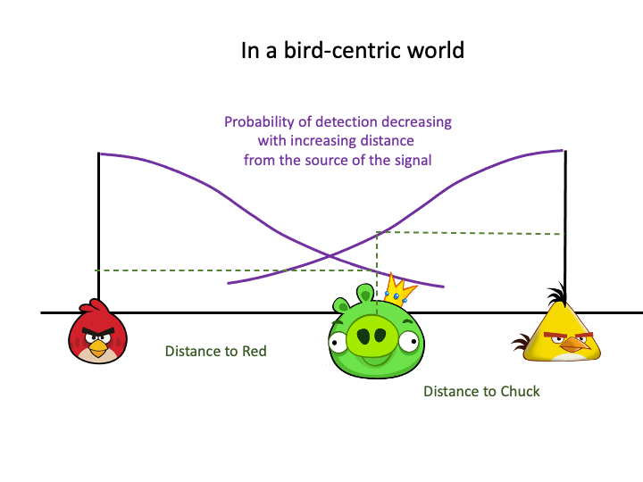
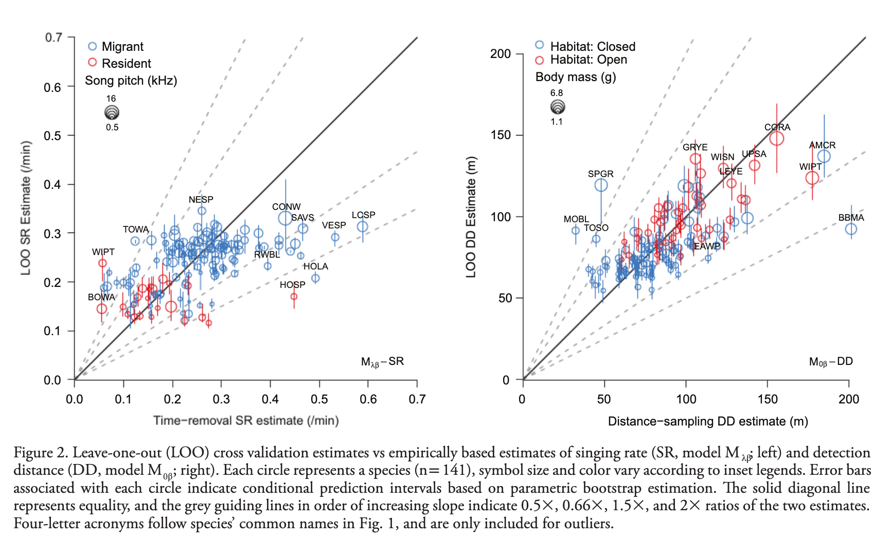

```{r setup,include=FALSE}
options(width=53, scipen=999)
library(knitr)
```

# Outline

Day 1

- ~~Introduction~~
- ~~We need to talk about data~~
- ~~A primer in regression techniques~~

Day 2

- ~~Behavioral complexities~~
- ~~Removal models and assumptions~~

Day 3

- The detection process
- Distance sampling

Day 4

- Putting it all together
- Roadside surveys & recordings

***

# Get course materials

1. Visit [https://github.com/psolymos/qpad-workshop/releases](https://github.com/psolymos/qpad-workshop/releases)
2. Download the latest release into a __NEW__ folder
3. Extract the zip/tar.gz archive
4. Open the `workshop.Rproj` file in RStudio (or open any other R GUI/console and `setwd()` to the directory where you downloaded the file)
5. Move your __LOCAL__ files into the new folder to keep things together

***

# Local copy

Avoid conflicts as we update the workshop materials: work in a __LOCAL__ copy of the R markdown files

```{r eval=FALSE}
source("src/functions.R")
qpad_local(day=3)
```

LOCAL copies will not be tracked and overwritten by git. You can copy new files over and it will not impact your local copies.

***

# Estimating nuisance variables

We have discussed how to estimate $p$ based on removal modeling.

Next we will discuss how to estimate $q$ based on distance sampling.

***

# Are we hearing into the forest?

\centering
```{r echo=FALSE,out.width="300px"}

```

***

# Is the sound coming out of the forest?

\centering
```{r echo=FALSE,out.width="300px"}

```

***

# The detection process

The detection itself is often triggered by **visual** or **auditory** cues,
and thus depend on the individuals being available for detection 
(and of course being present in the survey area).

The detection is the physical act of registering a signal, and is related to sensitivity of the receptor, and not the psychological processing of the detected signal (detection vs. transcription). I.e. detection depends on the distance, but not perceived distance (measurement error).

***

# The distance function

$g(d)$ describes the probability of detecting an individual
given the distance $d$ between the **source** of the signal and 
**receptor** (e.g. human ear).

- It is a monotonic decreasing function of distance,
- $g(0)=1$: detection at 0 distance is perfect.

***

# Negative Exponential

- one-parameter function: $g(d) = e^{-d/\tau}$
- probability quickly decreases with distance, this mirrors sound attenuation under spherical spreading
- suitable form for acoustic recording devices,
- not a very useful form for human based counts

***

# Half-Normal

- one-parameter function: $g(d) = e^{-(d/\tau)^2}$
- probability initially remain high (the _shoulder_), reflecting an increased chance of detecting individuals closer to the observer
- practical advantages that we will discuss shortly ($\tau^2$ is variance of the unfolded Normal distribution, $\tau^2/2$ is the variance of the Half-Normal distribution)

Negative Exponential and the Half-Normal are special cases of $g(d) = e^{-(d/\tau)^b}$ that have the parameter $b$ [$b > 0$] affecting the shoulder

***

# Hazard Rate

- two-parameter model: $g(d) = 1-e^{-(d/\tau)^-b}$
- parameter $b$ ($b > 0$) affecting the more pronounced and sharp shoulder

***

# Distance functions

\centering
```{r echo=FALSE,fig.width=6, fig.height=5,out.width="250px"}
d <- seq(0, 2, 0.01)
plot(d, exp(-d/0.8), type="l", col=1, ylim=c(0,1), lwd=2,
  xlab="Distance (100 m)", ylab="P(detection)", main="")
lines(d, exp(-(d/0.8)^2), type="l", col=2, lwd=2)
lines(d, 1-exp(-(d/0.8)^-4), type="l", col=3, lwd=2)
legend("topright", bty="n", lty=1, col=c(1,2,4), lwd=2,
  legend=c("Negative Exponential", "Half-Normal", "Hazard Rate"))
```

***

# Distance sampling

The distribution of the _observed distances_ is a product of detectability and the distribution of the individuals with respect to the point where the observer is located

- for point counts, area increases linearly with radial distance
- this implyes a triangular distribution: $h(d)=\pi 2 d /A=\pi 2 d / \pi r_{max}^2=2 d / r_{max}^2$
- where  $A$ is a circular survey area with truncation distance $r_{max}$

The product $g(d) h(d)$ gives the density function of the observed distances.

***

# Product

\centering
```{r echo=FALSE,fig.width=6, fig.height=5,out.width="250px"}
g <- function(d, tau, b=2, hazard=FALSE)
  if (hazard)
    1-exp(-(d/tau)^-b) else exp(-(d/tau)^b)
h <- function(d, rmax)
  2*d/rmax^2
rmax <- 4
tau <- 2
d <- seq(0, rmax, 0.01)
plot(d, g(d, tau), type="l", col=1, lwd=2, ylim=c(0,1),
  xlab="d", ylab="g(d)", main="")
lines(d, h(d, rmax), type="l", col=2, lwd=2)
lines(d, g(d, tau) * h(d, rmax), type="l", col=4, lwd=2)
legend("topright", bty="n", lty=1, lwd=2, col=c(1,2,4),
  legend=c("g(d)", "h(d)", "g(d) h(d)"))
```

***

# Average detection

Average probability of detecting individuals within a circle with truncation distance $r_{max}$

- we need to integrate over the product of $g(r)$ and $h(r)$
- $q(r_{max})=\int_{0}^{r_{max}} g(r) h(r) dr$

This is the volume of _pie dough_ cut at $r_{max}$, compared to the volume of the _cookie cutter_ ($\pi r_{max}^2$)

***

# Average detection: q

\centering
```{r echo=FALSE,fig.width=6, fig.height=5,out.width="250px"}
source("src/functions.R")         # some useful stuff
f <- function(d, tau, b=2, hazard=FALSE, rmax=1) 
  g(d, tau, b, hazard) * h(d, rmax)
q <- sapply(d[d > 0], function(z)
  integrate(f, lower=0, upper=z, tau=tau, rmax=z)$value)

plot(d, c(1, q), type="l", col=4, ylim=c(0,1), lwd=2, 
  xlab=expression(r[max]), ylab=expression(q(r[max])), 
  main="Average prob. of detection")
```

***

# Half-Normal

For the Half-Normal detection function, the analytical solution for the  average probability is

$$\frac{ \pi \tau^2 [1-exp(-d^2/\tau^2)]}{\pi r_{max}^2}$$

where the denominator is a normalizing constant representing the volume of a cylinder of perfect detectability.

***

# $q(r)$ = black / (black + blue)

\centering
```{r echo=FALSE,fig.width=7,fig.height=5,out.height="150px"}
tau <- 2
rmax <- 2
w <- 0.1
m <- 2
plot(0, type="n", xlim=m*c(-rmax, rmax), ylim=c(-w, 1+w), 
  axes=FALSE, ann=FALSE)
yh <- g(rmax, tau=tau)
lines(seq(-rmax, rmax, rmax/100),
  g(abs(seq(-rmax, rmax, rmax/100)), tau=tau))
draw_ellipse(0, yh, rmax, w, lty=2)
lines(-c(rmax, rmax), c(0, yh))
lines(c(rmax, rmax), c(0, yh))
draw_ellipse(0, 0, rmax, w)
draw_ellipse(0, 1, rmax, w, border=4)
lines(-c(rmax, rmax), c(yh, 1), col=4)
lines(c(rmax, rmax), c(yh, 1), col=4)
```

***

# Cell probabilities for Half-Normal

The cumulative density function for the Half-Normal distribution:

- $\pi(r) = 1-e^{-(r/\tau)^2}$
- used to calculate cell probabilities for binned distance data
- the normalizing constant is the area of the integral: $\pi \tau^2$ (instead of $\pi r_{max}^2$)

It captures the proportion of the observed distances relative to the whole volume of the observed distance density.

In the pie analogy, this is the dough volume inside the cookie cutter, compared to the dough volume inside and outside of the cutter (that happens to be $\pi \tau^2$ for the Half-Normal)

***

# $\pi(r)$ = black / (black + red)

\centering
```{r echo=FALSE,fig.width=7,fig.height=5,out.height="150px"}
plot(0, type="n", xlim=m*c(-rmax, rmax), ylim=c(-w, 1+w), 
  axes=FALSE, ann=FALSE)
yh <- g(rmax, tau=tau)
lines(seq(-m*rmax, m*rmax, rmax/(m*100)),
  g(seq(-m*rmax, m*rmax, rmax/(m*100)), tau=tau),
  col=2)
lines(seq(-rmax, rmax, rmax/100),
  g(abs(seq(-rmax, rmax, rmax/100)), tau=tau))
draw_ellipse(0, yh, rmax, w, lty=2)
lines(-c(rmax, rmax), c(0, yh))
lines(c(rmax, rmax), c(0, yh))
draw_ellipse(0, 0, rmax, w)
```

***

# EDR

In case of the Half-Normal distance function, $\tau$ is the _effective detection radius_ (EDR)

The effective detection radius is the distance from observer where the number of individuals missed within EDR (volume of 'air' in the cookie cutter above the dough) equals the number of individuals detected outside of EDR (dough volume outside the cookie cutter)

EDR is the radius $r_e$ where $q(r_e)=\pi(r_e)$:

***

# EDR: where blue = red

\centering
```{r echo=FALSE,fig.width=7,fig.height=5,out.height="150px"}
plot(0, type="n", xlim=m*c(-rmax, rmax), ylim=c(-w, 1+w), 
  axes=FALSE, ann=FALSE)
yh <- g(rmax, tau=tau)
lines(seq(-m*rmax, m*rmax, rmax/(m*100)),
  g(seq(-m*rmax, m*rmax, rmax/(m*100)), tau=tau),
  col=2)
lines(seq(-rmax, rmax, rmax/100),
  g(abs(seq(-rmax, rmax, rmax/100)), tau=tau))
draw_ellipse(0, yh, rmax, w, lty=2)
lines(-c(rmax, rmax), c(0, yh))
lines(c(rmax, rmax), c(0, yh))
draw_ellipse(0, 0, rmax, w)
draw_ellipse(0, 1, rmax, w, border=4)
lines(-c(rmax, rmax), c(yh, 1), col=4)
lines(c(rmax, rmax), c(yh, 1), col=4)
```

***

# Estimation

The function $\pi(r)$ increases monotonically from 0 to 1

\centering
```{r echo=FALSE,fig.width=7,fig.height=4,out.height="150px"}
curve(1-exp(-(x/tau)^2), xlim=c(0, 5), ylim=c(0,1), col=4, lwd=2,
  ylab=expression(pi(d)), xlab=expression(d), 
  main="Cumulative density")
```

***

# Binning

\centering
```{r echo=FALSE,fig.width=7,fig.height=5,out.width="250px",message=FALSE,warning=FALSE}
library(bSims)
library(detect)
tau <- 2
set.seed(123)
l <- bsims_init()
a <- bsims_populate(l, density=10)
b <- bsims_animate(a, initial_location=TRUE)
o <- bsims_detect(b, tau=tau)
br <- c(1, 2, 3, 4, 5, Inf)
tr <- bsims_transcribe(o, rint=br)
Y <- matrix(drop(tr$removal), nrow=1)
D <- matrix(br, nrow=1)
tauhat <- exp(cmulti.fit(Y, D, type="dis")$coef)
da <- sqrt(rowSums(a$nests[,c("x", "y")]^2))
dt <- get_detections(o)
dat <- data.frame(
  distance=da, 
  x=-da^2, 
  detected=ifelse(rownames(o$nests) %in% dt$i, 1, 0))

dat$bin <- cut(da, c(0, br), include.lowest = TRUE)
counts <- with(dat, table(bin, detected))

plot(stepfun(1:6, c(0, cumsum(counts[,"1"])/sum(counts[,"1"]))), 
  do.points=FALSE, main="Binned CDF",
  ylab="Cumulative probability", 
  xlab="Bin radius end point (100 m)")
curve(1-exp(-(x/tau)^2), col=2, add=TRUE)
curve(1-exp(-(x/tauhat)^2), col=4, add=TRUE)
legend("topleft", bty="n", lty=1, col=c(2, 4, 1), 
  legend=c("True", "Estimated", "Empirical"))
```


***

# Traits can help

\centering
```{r echo=FALSE,out.width="300px"}

```
