```{r setup,include=FALSE}
options(width=53, scipen=999)
library(knitr)
```

# Outline

Day 1

- ~~Introduction~~
- ~~We need to talk about data~~
- ~~A primer in regression techniques~~

Day 2

- ~~Behavioral complexities~~
- ~~Removal models and assumptions~~

Day 3

- ~~The detection process~~
- ~~Distance sampling~~

Day 4

- Putting it all together
- Roadside surveys & recordings

***

# Get course materials

1. Visit [https://github.com/psolymos/qpad-workshop/releases](https://github.com/psolymos/qpad-workshop/releases)
2. Download the latest release into a __NEW__ folder
3. Extract the zip/tar.gz archive
4. Open the `workshop.Rproj` file in RStudio (or open any other R GUI/console and `setwd()` to the directory where you downloaded the file)
5. Move your __LOCAL__ files into the new folder to keep things together

***

# Local copy

Avoid conflicts as we update the workshop materials: work in a __LOCAL__ copy of the R markdown files

```{r eval=FALSE}
source("src/functions.R")
qpad_local(day=4)
```

LOCAL copies will not be tracked and overwritten by git. You can copy new files over and it will not impact your local copies.

***

# Estimating nuisance variables

We discussed how to estimate $p$ based on removal modeling.

And how to estimate $q$ based on distance sampling.

***

# So why is this important?

$$E[Y]=NC=(AD)(pq)=qpAD$$
$$\hat{D}=E[Y]/(A\hat{p}\hat{q})$$

***

# Corrections

\centering
```{r echo=FALSE,out.width="300px"}
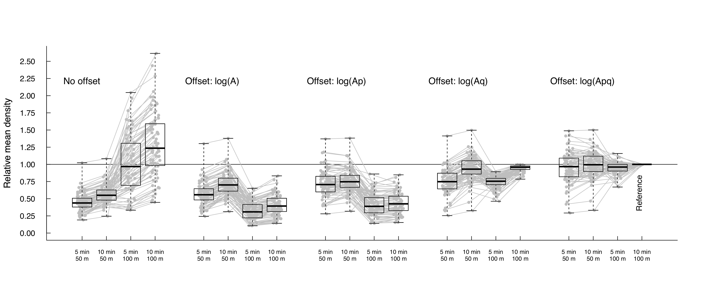
```

The corrections can be used to adjust for different methodologies
and other factors influencing availability and detectability.

***

# Ovenbird

\centering
```{r echo=FALSE,out.width="280px"}
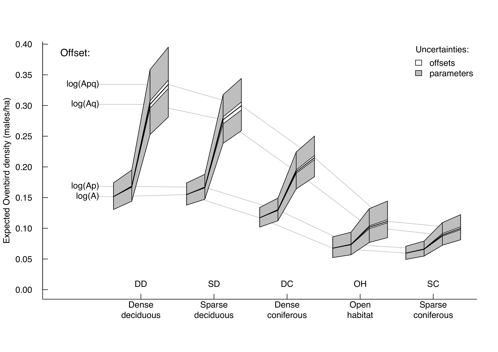
```

Density estimates using different corrections in 5 types of land cover

***

# Integrating projects

1. Normalize and join data from projects,
2. take multiple-duration subset and fit removal models,
3. take multiple-distance subset and fit distance sampling models,
4. predict $p$ and $q$ (or $A$) for all surveys,
5. use $log(Apq)$ offsets in log-linear models with total counts as response.

Removal and distance models can deal with multiple methodologies in the same model.

Each modeling step can include covariates, which can be the same.

***

# What to do if you can't estimate $p$ & $q$

See if you can use estimates from similar species.

- phylogenetic correlation
- trait info

[lhreg R package](https://borealbirds.github.io/lhreg/)

***

# What to do if you can't estimate $p$ & $q$

See if you can use estimates from similar studies.

- the species code
- coordinates and time
- max duration and distance

[BAM QPAD offsets](https://github.com/ABbiodiversity/recurring/blob/master/offset/README.md)

***

# Advantages

- Smaller parameter space,
- straightforward model selection,
- less colinearity,
- quicker than joint modeling via integrated likelihood.

***

# Advantages

\centering
```{r echo=FALSE,fig.show="hold", out.width="49%"}
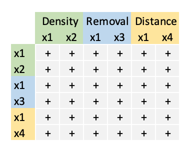
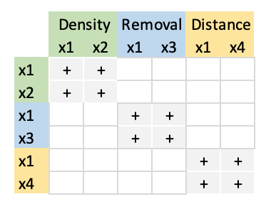
```

***

# Disadvantages

- Taking care of uncertainty needs more work
- Model validation gets a bit tricky

***

\centering
**BREAK**

***

# Recordings for acoustic surveys

Non-autonomous recording equipment have been used to 

- 'back up' field surveys (permanent record),
- to be able to get 2nd opinion (reviewed by multiple observers),
- or to be listened to and ID-ed in the lab, ability to listen multiple times.

Can be done by both trained and non-trained observers.

***

# Automated recording units (ARUs)

More increasingly, ARUs are used:

- minimum of two visits by field personnel,
- can be programmed (when and for how long),
- run over several months (battery, storage),
- no observer avoidance bias,
- to survey hard to access areas (on winter roads).

***

# Disadvantages

- Loss of data could go unnoticed for a longtime,
- temporal vs. spatial coverage trade-off,
- costs can be high (there is a wide range): purchase + maintenance (batteries, microphones, SD cards),

***

# Recordings


\centering
```{r echo=FALSE,out.width="300px"}
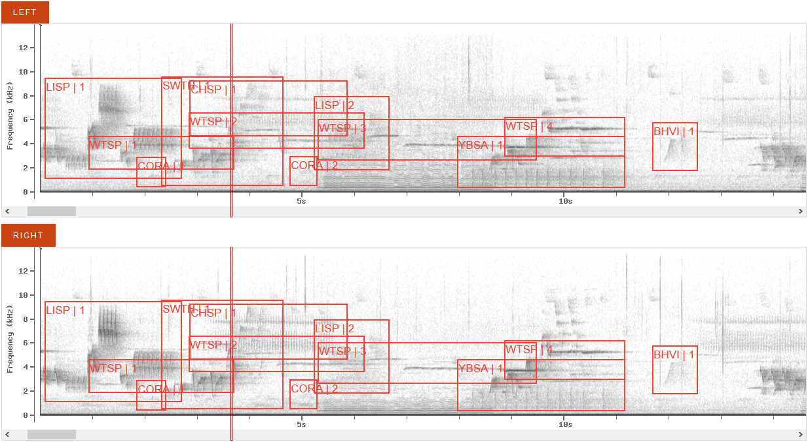
```

Sonogram from [WildTrax](http://www.wildtrax.ca/): an ARU/camera data platform.

***

# Sonograms

There are many ways the same recording can be transcribed:

- detection/non-detection,
- time to 1st detection in each 1-min interval (no individuals tracked),
- removal sampling in 3 or 10 minutes duration,
- full detection history by 1-min intervals,
- all detections.

***

# Integrating human PC & ARUs

It requires careful consideration of these aspects of sampling:

1. 'Transcription' level details: measure the same variables (make as human PC-like as possible),
2. human PC--ARU detectability differences: need to be understood and accounted for,
3. avoid extrapolation: dates and times sampled need to coincide or overlap,
4. check transferability: sometimes interpolation won't even work.

***

# Transcription

Make sure that ARU based counts have similar meaning to human point counts.

Usually this means shorter duration, it gets harder to track individuals with stereo headphones over 3 mins in busy recordings.

***

# Sub-intervals

**Time intervals**: both ARUs and human PCs can have multiple time intervals --- recordings can arbitrarily stratified and re-listened.

**Distance intervals**: humans in the field can assign birds to distance bands, ARU based assignment becomes difficult (relative distance, needs calibration) --- ARU based counts are like $0-\infty$ m unlimited distance counts.

***

# Sound pressure level vs. EDR

\centering
```{r echo=FALSE,out.width="300px"}
include_graphics("images/yip-2017-ace-fig-3.jpg")
```

Yip et al. 2017, [ACE](http://dx.doi.org/10.5751/ACE-00997-120111).

***

# Distance effects on ARU data

\centering
```{r echo=FALSE,out.width="250px"}
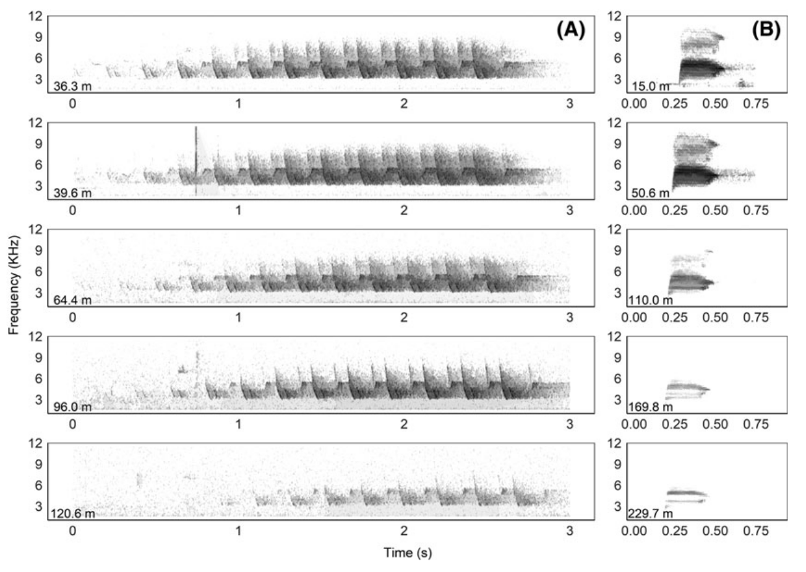
```

Sonogram images are different[^1].

[^1]: Yip et al. 2019, [RSEC](http://dx.doi.org/10.1002/rse2.118).

***

# Distance estimation based on ARU data

\centering
```{r echo=FALSE,out.width="300px"}
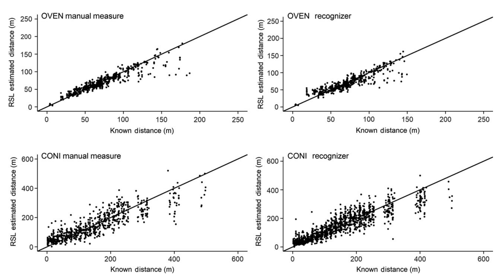
```

Use known distances to calibrate relationship[^2].

[^2]: Yip et al. 2019, [RSEC](http://dx.doi.org/10.1002/rse2.118).

***

# What is a recognizer?

Recognizer is a computational classifier that is trained on a set of data and then applied to classify independent data sets.

Often based on elliptical Fourier transformation or image recognition algorithms (deep learning, natural nets).

The recognizer gives a probabilistic output (reliability score) for each detection.

***

# Human PC--ARU detectability differences

\centering
```{r echo=FALSE,out.width="130px"}
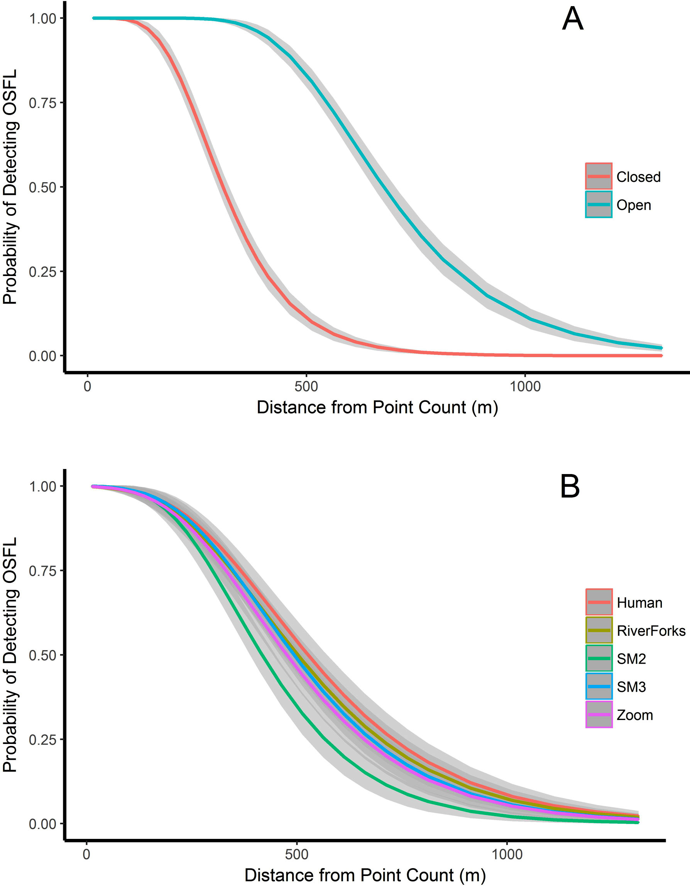
```

ARUs are like different observers[^2].

***

# Human PC--ARU detectability differences

\centering
```{r echo=FALSE,out.width="150px"}
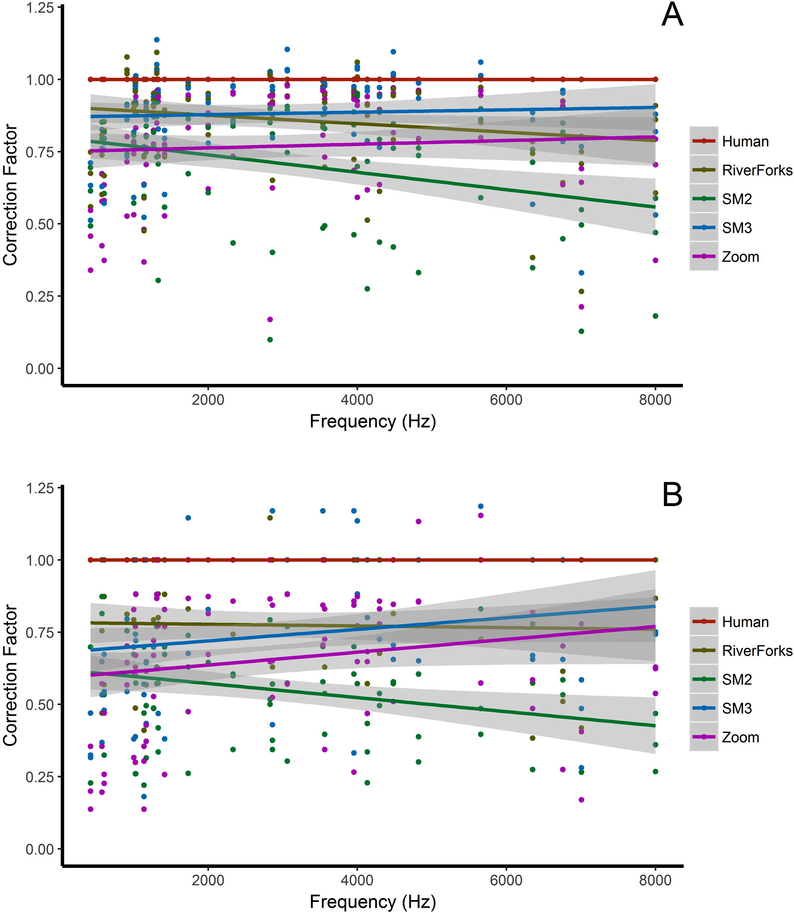
```

Different sensitivity leads to different EDR (A) and MDD (B).

***

# Issues with extrapolation

Human PC usually happens in late May early June, between 2 to 8 am --- ARUs can record any time.

If dates and times are different, it can make surveys and recordings in comparable:

- How do you compare a dawn PC to midnight recording? (availability is different)
- How do you compare a March recording to a June PC for a migratory species? (true status is different)

***

# Model transferability

Even though we have same dates and times in training data, models are not necessarily transferable to other regions. E.g. Northwest Territories 
ARU surveys:

- white nights in the breeding season, meaning of midnight and sunrise is different from southern Boreal (need to build local availability models),
- migration to the north takes longer, phenology is shifted (use time since 1st day of spring or from NDVI based year specific green-up).
- lots of large burns and arctic tundra: larger than usual EDRs (this requires calibration).

***

# How do we do this?

1. Calibration based on **playback experiments** (pure tones, recorded songs): true state is _known_, differences are assessed against this know truth,
2. Calibration based on **paired sampling** (human PC recorded and transcribed): true state is _unknown but identical_,
3. Model based approach (ARU type as a fixed effect): true state is neither known nor identical, this works for larger samples given reasonable interspersion (i.e. avoid using this approach when human PC is in uplands, ARUs are in lowland habitats).

***

# Calibration based on playbacks

- True state is fixed ($N=1$),
- event times ($t$) are known (we push the button on the player),
- distances along the transect are known ($d$),
- only the detection process outcome varies ($Y$).

***

# Adjustments

We can fit logistic regression to estimate the form of the distance function, because we have non-detections too (it is only 1D: no need for integral).

We can estimate unlimited distance EDR for any device (although this is relative because sound pressures might not be realistic).

We can use human listener performance from the field, we can come up with adjustments for effective area sampled as: $EDR_R=\Delta EDR_H$.

***

# Recall: distance sampling

We linearized the Half-Normal relationship
by taking the log of the distance function: 

$$log(g(d)) =log(e^{-(d/\tau)^2})= -(d / \tau)^2 = x \frac{1}{\tau^2} = 0 + x \beta$$
Than we used GLM to fit a model:

- with $x = -d^2$ as predictor
- without intercept, 
- estimated $\hat{\beta}$
- calculate EDR as $\hat{\tau}=\sqrt{1/\hat{\beta}}$.

***

# Paired sample data set

\centering
```{r echo=FALSE,out.width="200px"}
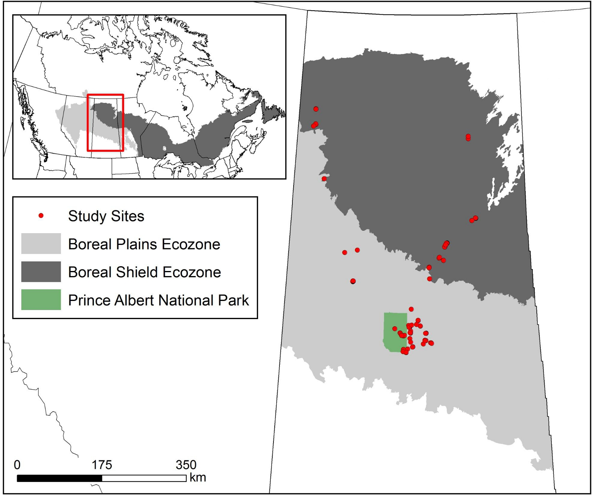
```

Van Wilgenburg et al. 2017 [ACE](https://doi.org/10.5751/ACE-00975-120113).

***

# The logic

$$\frac{E[Y_R]}{E[Y_H]} = \frac{D (EDR_R^2)p}{D (EDR_H^2)p}=\Delta^2$$

$D$ constant: fixed by design (same place, same time),

$p$ is assumed to be constant (observer is present at the time of recording).

The only thing that is driving the difference in counts is EDR.

***

# Testing availability

\centering
```{r echo=FALSE,out.width="200px"}
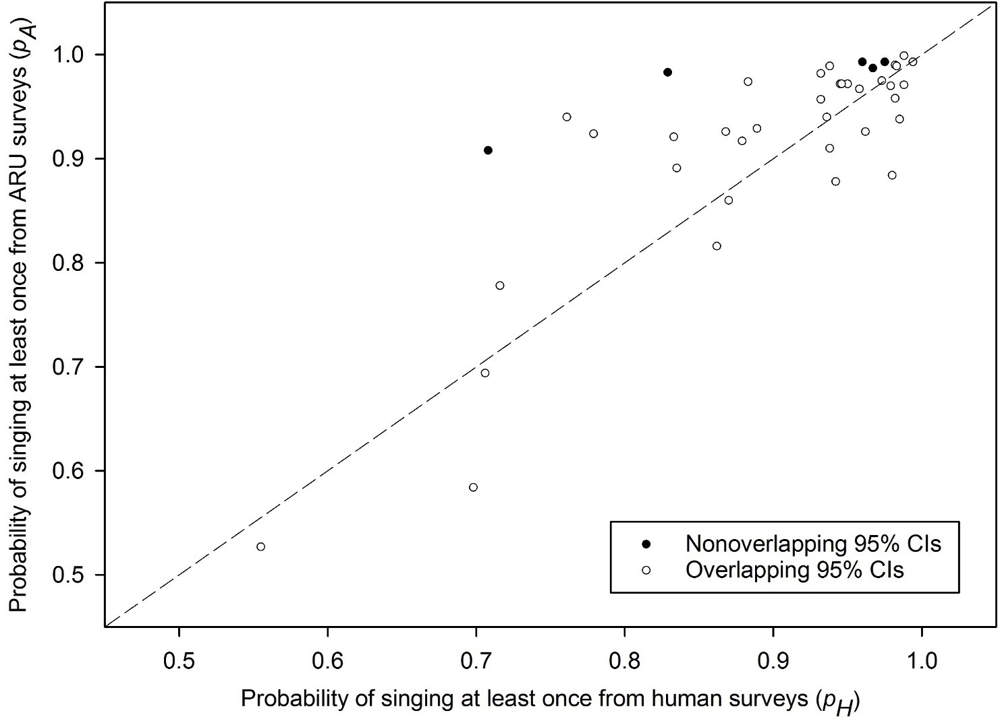
```

Availability was found to be not too variable (driven by count differences after detection differences).

***

# Empirical vs. model based $\Delta$

\centering
```{r echo=FALSE,out.width="200px"}
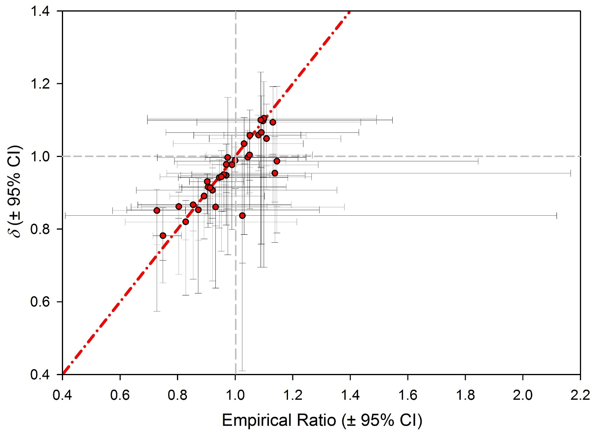
```

$\sum Y_R / \sum Y_H = \hat{\Delta}^2$ under paired sampling

***

# Paired sample data set

\centering
```{r echo=FALSE,out.width="150px"}
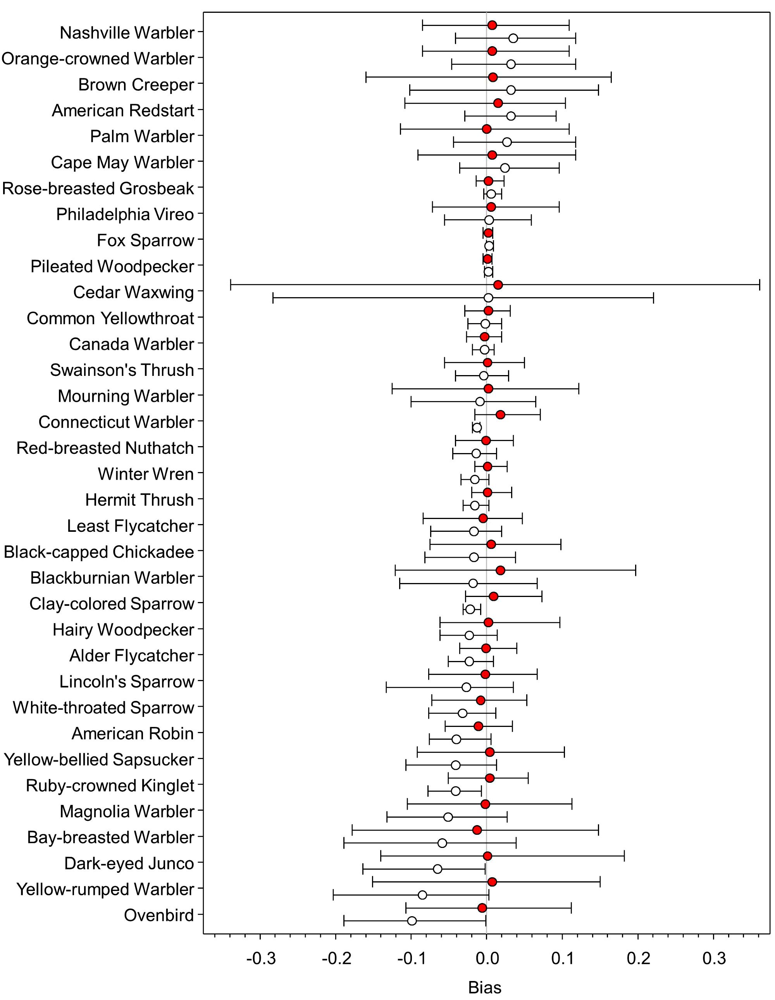
```

Using $\hat{\Delta}^2$ as adjustment really helps in integrating human PC and ARU data sets.


***

# Roadside bias

Roadside bias captures the difference between a roadside survey count ($E[Y_R]$)
and a count done in a similar off-road environment ($E[Y_H]$).

Large variation across species:

- forest associated species show negative roadside bias ($E[Y_R] < E[Y_H]$),
- generalist and open-field species show positive roadside bias ($E[Y_R] > E[Y_H]$).

The bias is predominantly negative in the forests.

***

# Mechanisms of roadside bias

1. Numeric response: $D_R \neq D_H$, e.g. birds usually don't nest on pavement,
2. behavioral response: $\phi_R \neq \phi_H$, increased/decreased singing activity along roads,
3. detectability differences: $\hat{A}_R \neq \hat{A}_H$ roads create an opening in forests thus increasing effective sampling area.

These are well known, but attribution (their relative importance) is quite difficult.

Also there are different kinds of roads (highways vs. unpaved trails), which might pose different mix of these mechanisms.

***

# Problem with small features

\centering
```{r echo=FALSE,out.width="250px"}
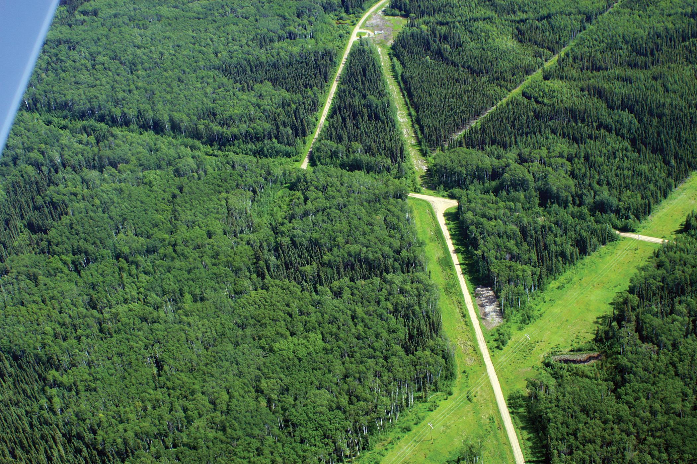
```

Bayne et al. 2016, [Condor](http://www.bioone.org/doi/10.1650/CONDOR-15-126.1).

***

# Survey design

\centering
```{r echo=FALSE,out.width="250px"}
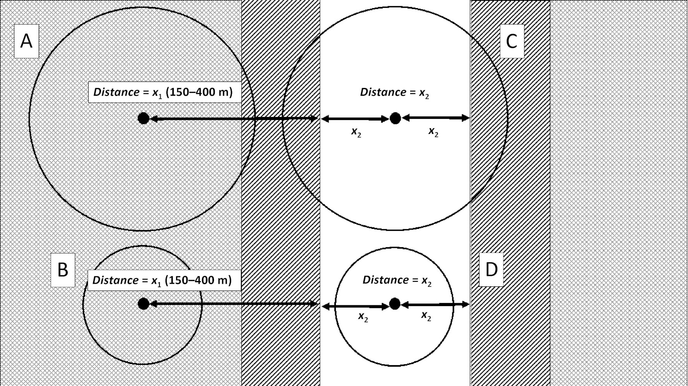
```

***

# Results

\centering
```{r echo=FALSE,out.width="250px"}
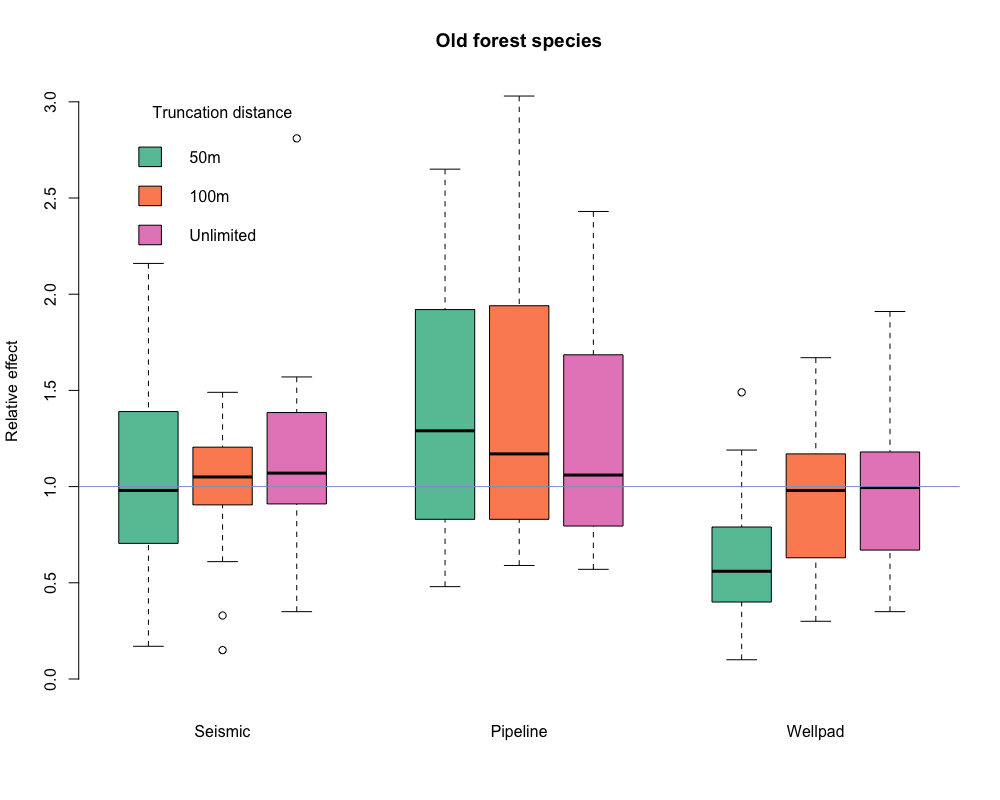
```

Bayne et al. 2016, [Condor](http://www.bioone.org/doi/10.1650/CONDOR-15-126.1).

***

# Results

\centering
```{r echo=FALSE,out.width="250px"}
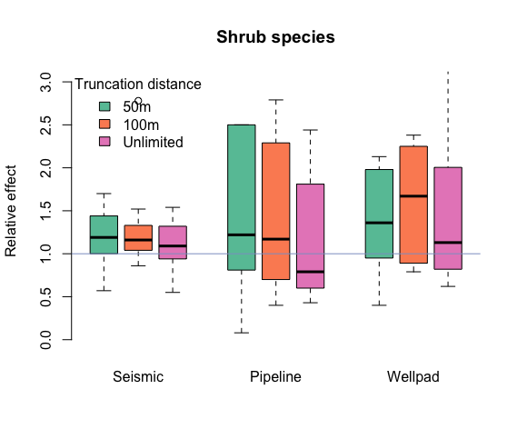
```

Bayne et al. 2016, [Condor](http://www.bioone.org/doi/10.1650/CONDOR-15-126.1).

***

# Stratified sampling

```{r echo=FALSE,fig.width=9,fig.height=7}
op <- par(mfrow=c(2,2))

set.seed(1)
n <- 100
x <- sort(runif(n, 0, 1))
Da <- 2
Db <- 6
lam <- x*Da + (1-x)*Db
y <- rpois(n, lam)
m <- glm(y ~ x, family=poisson)

plot(y ~ x, col="grey", ylim=c(0,12))
abline(h=c(Da, Db), lty=2)
rug(x, col=2)
lines(fitted(m) ~ x, col=2)
lines(c(0, 1), c(Db, Da), col=4)
legend("topright", bty="n", lty=1, col=c(4,2),
  legend=c("True", "Estimated"))

set.seed(1)
n <- 100
x <- sort(runif(n, 0, 1))
Db <- 2
Da <- 6
lam <- x*Da + (1-x)*Db
y <- rpois(n, lam)
m <- glm(y ~ x, family=poisson)

plot(y ~ x, col="grey", ylim=c(0,12))
abline(h=c(Da, Db), lty=2)
rug(x, col=2)
lines(fitted(m) ~ x, col=2)
lines(c(0, 1), c(Db, Da), col=4)

set.seed(1)
Da <- 2
Db <- 6
x <- sort(runif(n, 0, 0.2))
lam <- x*Da + (1-x)*Db
y <- rpois(n, lam)
m <- glm(y ~ x, family=poisson)
pr <- predict(m, type="response",
  newdata=data.frame(x=seq(0,1,0.01)))
plot(y ~ x, col="grey", xlim=c(0, 1), ylim=c(0,12))
abline(h=c(Da, Db), lty=2)
rug(x, col=2)
lines(pr ~ seq(0,1,0.01), col=2)
lines(c(0, 1), c(Db, Da), col=4)

set.seed(1)
Da <- 6
Db <- 2
x <- sort(runif(n, 0, 0.2))
lam <- x*Da + (1-x)*Db
y <- rpois(n, lam)
m <- glm(y ~ x, family=poisson)
pr <- predict(m, type="response",
  newdata=data.frame(x=seq(0,1,0.01)))
plot(y ~ x, col="grey", xlim=c(0, 1), ylim=c(0,12))
abline(h=c(Da, Db), lty=2)
rug(x, col=2)
lines(pr ~ seq(0,1,0.01), col=2)
lines(c(0, 1), c(Db, Da), col=4)

par(op)
```

***

# Behavior

It is like a mixture model where mixing probabilities
depend on the area of the strata.

Think of it as each group is made up of individuals living in the 
different strata (happen to be there for the duration of the survey),
acting in a certain way (sing more/less along the edges, 
not at all on the roads, etc.).

Problem is: due to the detection process, this really means
effective area, which involves a lot of integrals.

***

# Distance effects: design

\centering
```{r echo=FALSE,out.width="250px"}
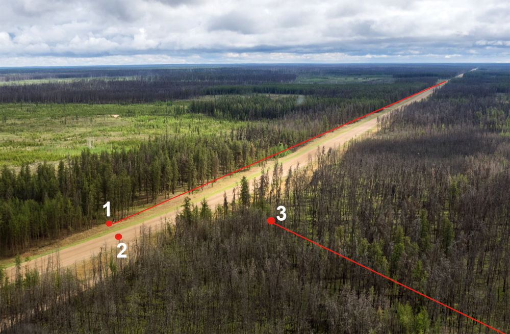
```

Yip et al. 2017, [Condor](http://dx.doi.org/10.1650/CONDOR-16-93.1).

***

# Distance effects: results

\centering
```{r echo=FALSE,out.width="250px"}
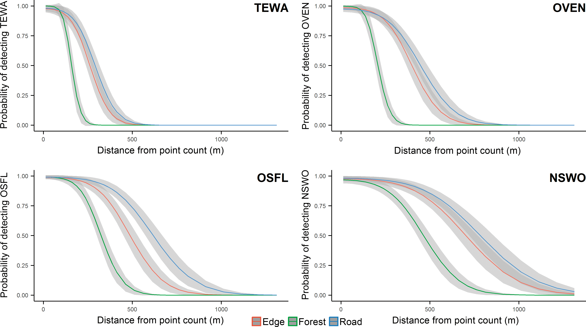
```

Yip et al. 2017, [Condor](http://dx.doi.org/10.1650/CONDOR-16-93.1).

***

# Sound attenuation: direction matters

\centering
```{r echo=FALSE,out.width="180px"}
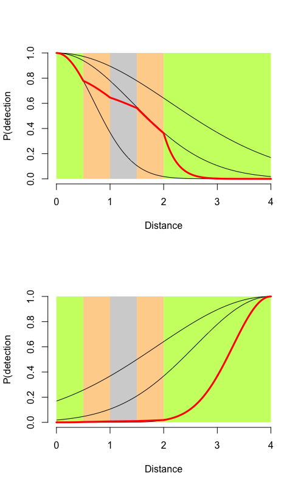
```

***

# Accounting for roadside bias

- Calibration: not very common, many kinds of habitat/road types, 
- joint modeling: difficult to estimate due to the complexities,
- fixed effects: possibly with interactions with land cover,
- design based approach: filter worst offenders.

I usually combine some filtering with fixed effects.

***

# The frontier

- More and more ARU data: how to optimize transcription, time to 1st detection information, etc.
- Automated species detection and distance estimation
- Robust & simple methods to integrate repeated visits without assuming closure
- Corrections for eBird data
- Corrections for roadside (BBS) data

***

# Population size estimates

Partner in Flight group: PIF population size estimates

- Uses BBS/roadside data
- Biased in the north (land cover, geography)
- Species respond to roads
- Time and detection distance adjustments have been criticized

***

# Alberta study

\centering
```{r echo=FALSE,out.width="250px"}
include_graphics("images/pifpix-fig-4.png")
```

Solymos et al. 2020, [Condor](https://doi.org/10.1093/condor/duaa007).

***

# Alberta study

\centering
```{r echo=FALSE,out.width="250px"}
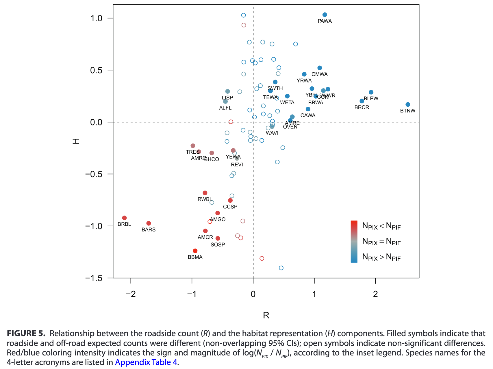
```

Roadsides issues are related to habitat sampling too

***

# Alberta study

\centering
```{r echo=FALSE,out.width="230px"}
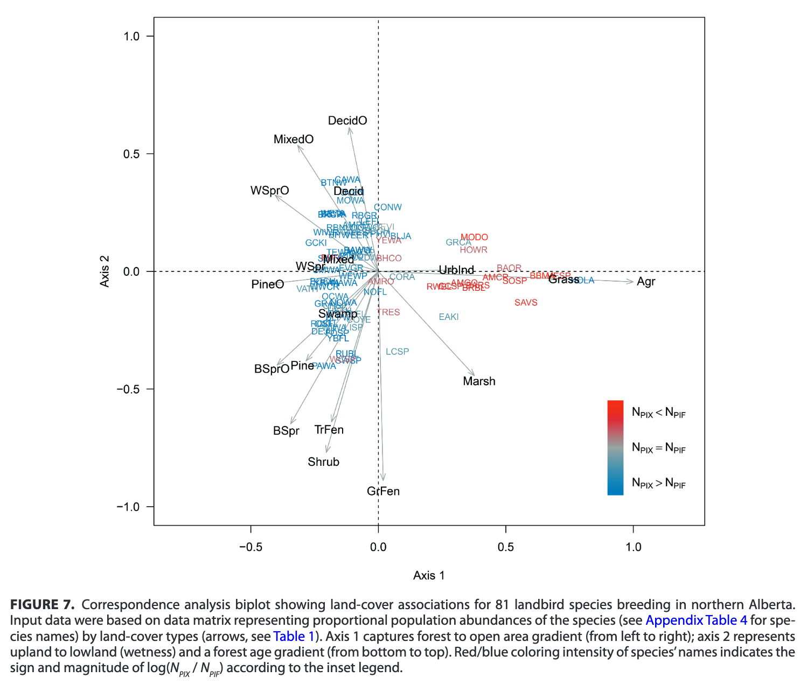
```

Bias depends on sampling and species

***

# Alberta results

Alberta Biodiversity Monitoring Institute and Boreal Avian Modelling Project

126 species

[science.abmi.ca/birds](https://science.abmi.ca/birds/)

***

# National model results

Boreal Avian Modelling Project

143 species

[borealbirds.github.io](https://borealbirds.github.io/)

***

# NA-POPS

Point count Offsets for Population Sizes of North America landbirds

- Improve PIF adjustments using QPAD ideas
- Provide roadside adjustments
- Expand to N America (US + Canada)
- All land birds

See [na-pops.org/](https://na-pops.org/)

***

# NA-POPS

\centering
```{r echo=FALSE,out.width="300px"}
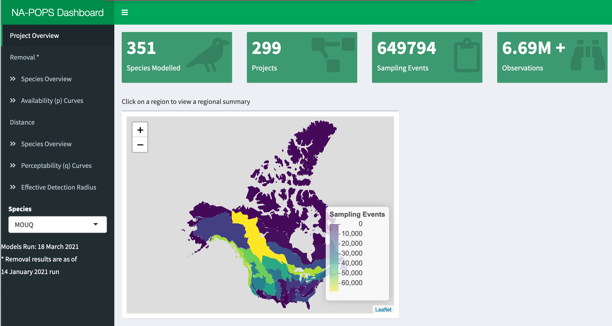
```
